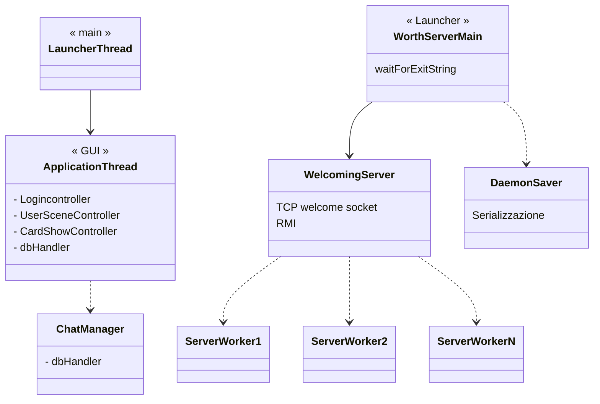
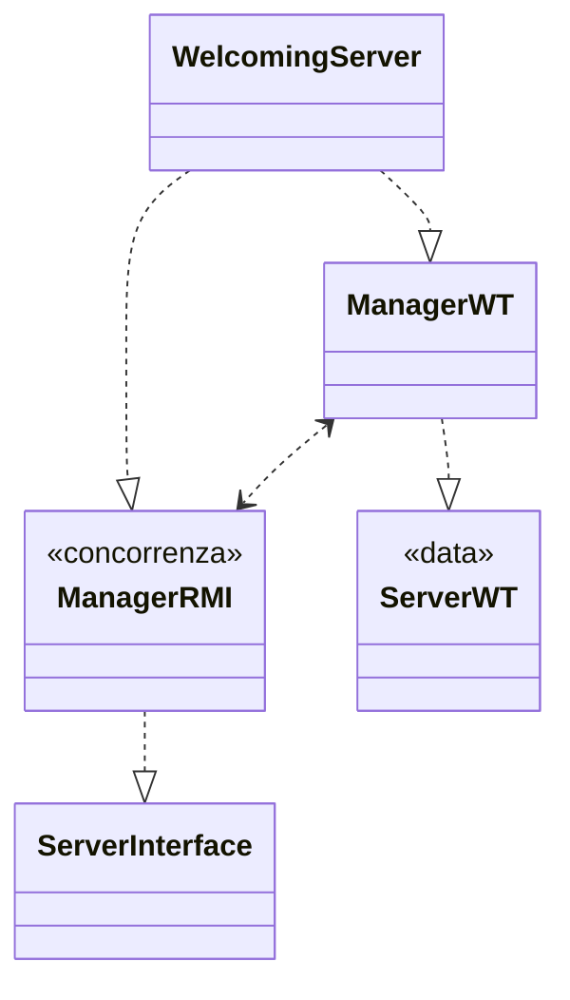

**PROGETTO WORTH**

LUDOVICO VENTURI, matricola 578033

*UniPi, a.a 2020/21*

---

<u>Indice</u>

[toc]

# Ambiente di lavoro

```bash
$java -version
openjdk version "14.0.2" 2020-07-14
OpenJDK Runtime Environment (build 14.0.2+12)
OpenJDK 64-Bit Server VM (build 14.0.2+12, mixed mode)
```

```bash
$ide-utilizzato
IntelliJ IDEA 2020.2.2 (Ultimate Edition)
Build #IU-202.7319.50, built on September 15, 2020
Licensed to Ludovico Venturi
Subscription is active until January 22, 2021
For educational use only.
Runtime version: 11.0.8+10-b944.31 amd64
VM: OpenJDK 64-Bit Server VM by JetBrains s.r.o.
Linux 5.4.85-1-manjaro
GC: ParNew, ConcurrentMarkSweep
Memory: 1937M
Cores: 16
Registry: ide.balloon.shadow.size=0
Non-Bundled Plugins: com.berzanmikaili.intellij.monokai_pro
Current Desktop: KDE
```

Le varie dipendenze, con le relative versioni, sono riportate nel `pom.xml` utilizzato da Maven che le gestisce in automatico.

## Compatibilità

Non garantisco la piena compatibilità dell'applicazione su altre macchine dato che ho provato ad eseguire il progetto su una macchina Linux ed una Windows ottenendo risultati purtroppo non  soddisfacenti. Non sono riuscito a rimediare a tale situazione in tempi brevi (il codice comunque *dovrebbe compilare* sempre). 

Sulla prima ho avuto problemi di Charset mentre sulla seconda problemi di visualizzazione della GUI (piuttosto gravi da renderlo inutilizzabile). 
Ho dedicato pressochè tutto il tempo allo sviluppo sulla mia macchina scoprendo queste problematiche solo ad uno stadio avanzato del progetto, motivo per cui non ho avuto modo di aumentarne la compatibilità. 

Per dare un'idea di come il programma *dovrebbe essere* secondo la volontà dello sviluppatore allego nella cartella un video dimostrativo, che invito a visionare per notare eventuali differenze. 
Ci tengo a precisare che ho fatto il possibile, le mie conoscenze si fermano qui e almeno sulla mia macchina tutto funziona come dovrebbe (a meno di bug a me ignoti, che saranno comunque presenti).

# Manuale d'uso

Per compilare ed eseguire il progetto è necessario installare sulla propria macchina il gestore di dipendenze **Maven**. La guida ufficiale per scaricare ed installare Maven è consultabile [qui](https://maven.apache.org/install.html).
É necessario settare la variabile d'ambiente `JAVA_HOME` e consiglio anche di settare `JAVA_TOOL_OPTIONS='file.encoding="UTF-8"'`

I comandi per compilare (ed eseguire) il progetto sono:

- `mvn -Pserver` 
  - per avviare il server. Invito ad aspettare che il server parta e poi far partire uno o più client con:
- `mvn clean javafx:run` 

I comandi vanno lanciati da terminali nella directory principale (578033 VENTURI LUDOVICO/).

Per abilitare le stampe di eventuali stacktrace di eccezioni (anche se non dovrebbero generarsi) è sufficiente aggiungere `-e` al comando (es: `mvn -Pclient -e`).

Per chiudere il server in modo corretto scrivere sulla console `exit`, mentre per il client si può o chiudere premendo sulla X della finestra o cliccando sul bottone LOGOUT nel tab INFO.

# Scelte progettuali

## Threads




## Client

Ho realizzato in **JavaFX** la GUI dell'applicazione.

La chat è stata implementata tramite UDP multicast con canali **NIO** e salvataggi delle chat su un database **Derby** integrato nell'applicazione. Un utente salva le chat di tutti i progetti di cui è membro e può visionarne i messaggi dal momento in cui l'applicazione è a conoscenza che il client fa parte di un progetto.

Viene utilizzato un thread ChatManager che riceve dal controller dell'applicazione, tramite una **pipe unnamed** (NIO) l'inidirizzo multicast cui connetttersi.

Quando la finestra della GUI del client viene chiusa viene una mandata una richiesta di **EXIT** che informa il server di chiudere quella connessione TCP in quanto non verranno effettuati altri login. 

Il database della chat viene acceduto tramite 2 connessioni differenti dato che 2 thread diversi vi accedono. Ho seguito la seguente linea guida:
*«If thread A does database work that is not transactionally related to thread B, assign them to*
*different Connections».* - Java DB Developer's Guide

Per l'aggiornamento automatico della Chat nel `ClientLogic`, al momento dell'istanziamento di un'istanza di `DbHandler`, setto  la variabile statica `currentChatMsgList` passando una  `ObservableList <ChatMsgObservable>` .

Per migliorare le prestazioni nella comunicazione TCP ho usato un'operazione `showProject()` nella quale il server invia le informaizoni necessarie per le operazioni (lato client) di showCards, showCard e getCardHisotry (invia un oggetto di tipo `Project` che contiene tutte le Cards e le relative info). 
Ho interpretato la specifica di avere determinati metodi da implementare, quali `getCardHistory() `come le possibili azioni che l'utente può compiere (in una GUI), piuttosto che le operazioni da effettuare sulla comunicazione TCP. 
Per le restanti operazioni non vi è differenza fra operazioni dell'utente, le richieste TCP effettuate e le specifiche.

## Server

Il server è gestito in maniera multithreaded e multiplexed, ovvero in ogni thread worker creato è presente un `selector` che gestitsce i vari canali NIO.

L'implementazione dei server worker non è completamente efficiente in quanto i thread rimangono sempre *vivi* in questa versione, anche se non stanno servendo nessun client (si fermano in attesa sulla `select()`) ma risulta molto scalabile e facilmente migliorabile. 

Non ho dedicato molto tempo ad un miglioramento di queste prestazioni in quanto per un uso "domestico" il problema è limitato e ci tenevo principalmente a strutturare il progetto in modo da garantire la scalabilità.

Serializzo anche i campi statici del progetto, altrimenti perderei informazioni importanti quali la lista degli `ipFree`.

### Oggetti del Server




## Concorrenza

La concorrenza lato server viene gestita dalla classe **ServerManagerWT** che è l'unica ad avere accesso diretto ai dati dell'applicazione. Tutti gli accessi a questi dati sono garantiti essere thread-safe dato che i metodi che vi accedono, nella classe Manager, sono `synchronized`.

Viene usata una ConcurrentHashMap solamente per salvare gli stub dei client per le callback RMI, che risulta thread-safe e più efficiente per operazioni semplici come aggiunta e rimozione senza ulteriori controlli.

Ho reputato opportuno non utilizzare nè ConcurrentHashMap nè un Database per i dati del server sia per

# Comunicazioni

```sequence
title: COMUNICAZIONE CLIENT-SERVER - RMI
Client->Server: REGISTER(username, password)
Server-->Client: REGISTRATION_OK || USERNAME_ALREADY_PRESENT
```

La comunicazione TCP è di tipo **stateful** in quanto una volta effettuato il login viene mantenuto il nome utente durante la comunicazione, senza bisogno di reinviarlo per ogni richiesta.

```sequence
title: COMUNICAZIONE CLIENT-SERVER: Protocollo, operazioni
Client->Server: LOGIN;username;password
Server-->Client: LOGIN_OK \n USERNAME_NOT_PRESENT || PSW_INCORRECT || ALREADY_LOGGED_IN
Client->Server: LOGOUT
Server-->Client: LOGOUT_OK || USERNAME_NOT_PRESENT || USER_NOT_ONLINE
Client->Server: CREATE_PROJECT;projectName
Server-->Client: CREATE_PROJECT_OK || PROJECT_ALREADY_PRESENT || \n SERVER_INTERNAL_NETWORK_ERROR || USERNAME_NOT_PRESENT
Client->Server: LIST_PROJECTS
Server-->Client: LIST_PROJECTS;JSON || USERNAME_NOT_PRESENT \n JSON content: [proj1;IP1;PORT1;proj2;IP2;PORT2;..;..]
Client->Server: SHOW_MEMBERS;projectName
Server-->Client: SHOW_MEMBERS_OK;member1;..;.. || USERNAME_NOT_PRESENT || PROJECT_NOT_PRESENT
Client->Server: ADD_MEMBER;projectName;newMember
Server-->Client: ADD_MEMBER_OK || USERNAME_NOT_PRESENT || USERNAME_INVALID ||\n USERNAME_ALREADY_PRESENT || PROJECT_NOT_PRESENT
Client->Server: SHOW_PROJECT;projectName
Server-->Client: SHOW_PROJECT_OK;JSON || PROJECT_NOT_PRESENT || USERNAME_NOT_PRESENT \n JSON content: [projName, toDoList..., cards history..]
Client->Server: MOVE_CARD;projectName;cardName;fromStatus;toStatus
Server-->Client: MOVE_CARD_OK || PROJECT_NOT_PRESENT || USERNAME_NOT_PRESENT || \nILLEGAL_OPERATION || CARD_FROM_STATUS_OUTDATED
Client->Server: DELETE_PROJECT;projectName
Server-->Client: DELETE_PROJECT_OK || USERNAME_NOT_PRESENT || PROJECT_NOT_PRESENT
Client->Server: ADD_CARD;projectName;cardName;description
Server-->Client: ADD_CARD_OK || USERNAME_NOT_PRESENT || PROJECT_NOT_PRESENT || \nCARD_ALREADY_PRESENT
```

```sequence
title: CHAT MULTICAST UDP
Sender->Multicast Group: CHAT_MSG;username;project;timeSent;msg
Note left of Multicast Group: (timeSent : LONG as String)
Note left of Multicast Group: (msg : max 2048 chars)
Server->Members: CHAT_STOP;SERVER;project
```


```sequence
title: PIPE communicaton
UserSceneController->ChatManager:  IP1;port1,IP2port2,....
```


# Ipotesi

- un utente può loggarsi una sola volta (no login multipli)
- vi è un limite superiore al numero progetti dato dal numero di IP multicast locali


