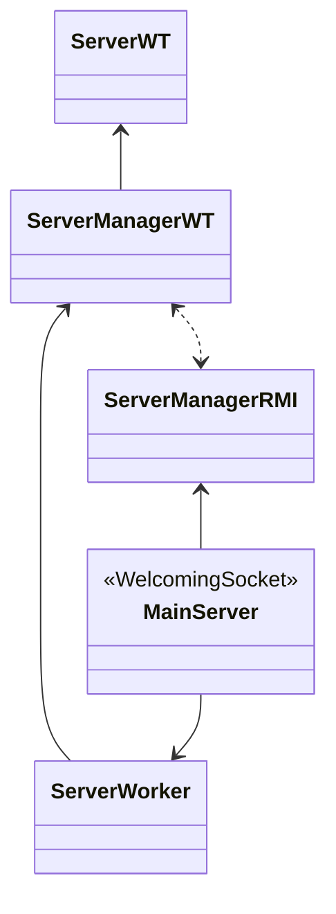

PROGETTO WORTH

Indice

[toc]

# Struttura classi



uso `ConcurrentHashMap` per le registrazioni in quanto tutte le operazioni sono garantite essere *thread-safe*. 
Non vi sono sovrapposizioni fra inserimenti e rimozioni in quanto un utente non può registrarsi ed effettuare il login contemporaneamente, pertanto reputo tale scelta la più efficiente garantendo l'accesso concorrente alla struttura dati. 
Di conseguenza non ho bisogno di gestire la concorrenza server-side riguardo l'RMI.

```sequence
title: COMUNICAZIONE CLIENT-SERVER - RMI
Client->Server: REGISTER(username, password)
Server-->Client: REGISTRATION_OK || USERNAME_ALREADY_PRESENT
```


```sequence
title: COMUNICAZIONE CLIENT-SERVER: Protocollo, operazioni
Client->Server: LOGIN;username;password
Server-->Client: LOGIN_OK \n USERNAME_NOT_PRESENT || PSW_INCORRECT || ALREADY_LOGGED_IN
Client->Server: LOGOUT
Server-->Client: LOGOUT_OK || USERNAME_NOT_PRESENT || USER_NOT_ONLINE
Client->Server: CREATE_PROJECT;projectName
Server-->Client: CREATE_PROJECT_OK;MulticastIP || PROJECT_ALREADY_PRESENT || \n SERVER_INTERNAL_NETWORK_ERROR || USERNAME_NOT_PRESENT
Client->Server: LIST_PROJECTS
Server-->Client: LIST_PROJECTS;proj1;proj2;..;.. || USERNAME_NOT_PRESENT
Client->Server: SHOW_MEMBERS;projectName
Server-->Client: SHOW_MEMBERS_OK;member1;..;.. || USERNAME_NOT_PRESENT || PROJECT_NOT_PRESENT
```

```sequence
title: CHAT MULTICAST UDP
Sender->Multicast Group: CHAT_MSG;username;project;timeSent;msg
Note left of Multicast Group: (timeSent : LONG as String)
Note left of Multicast Group: (msg : max 2048 chars)
```


# Ipotesi

- un utente può loggarsi su una sola connessione (no login multipli)


# Scelte

quando la finestra della GUI del client viene chiusa viene una mandata una richiesta di **EXIT** che informa il server di chiudere quella connessione TCP in quanto non verranno effettuati altri login. 

Se il client aveva effettuato l'accesso in aggiunta viene inviato una richiesta di **LOGOUT**.

Comunicazione TCP stateful, lo stato di utente loggato è registrato durante la comunicazione, infatti non si ha bisogno di passare nuovamente il proprio username.