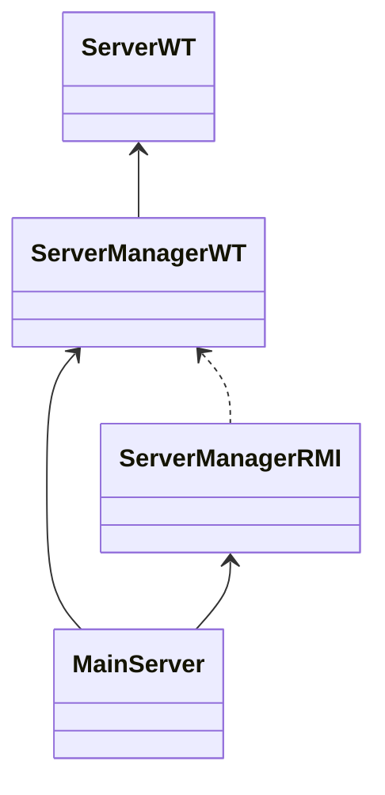

PROGETTO WORTH

Indice

[toc]

# Struttura classi

uso `ConcurrentHashMap` per le registrazioni in quanto tutte le operazioni sono garantite essere *thread-safe*. 
Non vi sono sovrapposizioni fra inserimenti e rimozioni in quanto un utente non può registrarsi ed effettuare il login contemporaneamente, pertanto reputo tale scelta la più efficiente garantendo l'accesso concorrente alla struttura dati. 
Di conseguenza non ho bisogno di gestire la concorrenza server-side riguardo l'RMI.
