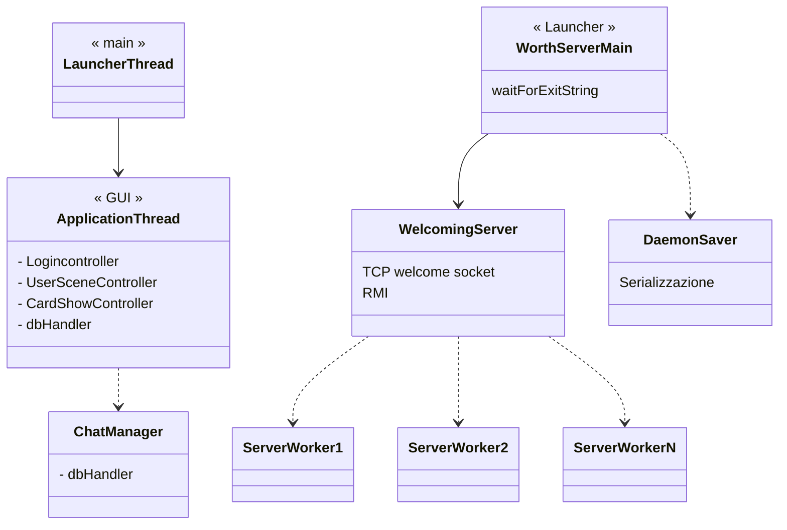
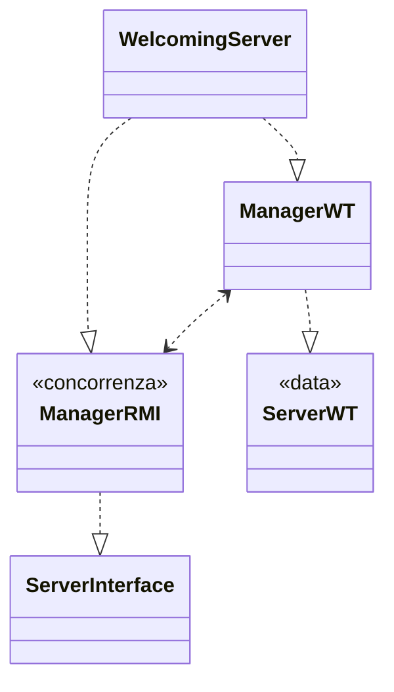

PROGETTO WORTH

Indice

[toc]

# Struttura classi

uso `ConcurrentHashMap` per le registrazioni in quanto tutte le operazioni sono garantite essere *thread-safe*. 
Non vi sono sovrapposizioni fra inserimenti e rimozioni in quanto un utente non può registrarsi ed effettuare il login contemporaneamente, pertanto reputo tale scelta la più efficiente garantendo l'accesso concorrente alla struttura dati. 
Di conseguenza non ho bisogno di gestire la concorrenza server-side riguardo l'RMI.

```sequence
title: COMUNICAZIONE CLIENT-SERVER - RMI
Client->Server: REGISTER(username, password)
Server-->Client: REGISTRATION_OK || USERNAME_ALREADY_PRESENT
```


```sequence
title: COMUNICAZIONE CLIENT-SERVER: Protocollo, operazioni
Client->Server: LOGIN;username;password
Server-->Client: LOGIN_OK \n USERNAME_NOT_PRESENT || PSW_INCORRECT || ALREADY_LOGGED_IN
Client->Server: LOGOUT
Server-->Client: LOGOUT_OK || USERNAME_NOT_PRESENT || USER_NOT_ONLINE
Client->Server: CREATE_PROJECT;projectName
Server-->Client: CREATE_PROJECT_OK || PROJECT_ALREADY_PRESENT || \n SERVER_INTERNAL_NETWORK_ERROR || USERNAME_NOT_PRESENT
Client->Server: LIST_PROJECTS
Server-->Client: LIST_PROJECTS;JSON || USERNAME_NOT_PRESENT \n JSON content: [proj1;IP1;PORT1;proj2;IP2;PORT2;..;..]
Client->Server: SHOW_MEMBERS;projectName
Server-->Client: SHOW_MEMBERS_OK;member1;..;.. || USERNAME_NOT_PRESENT || PROJECT_NOT_PRESENT
Client->Server: ADD_MEMBER;projectName;newMember
Server-->Client: ADD_MEMBER_OK || USERNAME_NOT_PRESENT || USERNAME_INVALID ||\n USERNAME_ALREADY_PRESENT || PROJECT_NOT_PRESENT
Client->Server: SHOW_PROJECT;projectName
Server-->Client: SHOW_PROJECT_OK;JSON || PROJECT_NOT_PRESENT || USERNAME_NOT_PRESENT \n JSON content: [projName, toDoList..., cards history..]
Client->Server: MOVE_CARD;projectName;cardName;fromStatus;toStatus
Server-->Client: MOVE_CARD_OK || PROJECT_NOT_PRESENT || USERNAME_NOT_PRESENT || ILLEGAL_OPERATION || CARD_FROM_STATUS_OUTDATED
Client->Server: DELETE_PROJECT;projectName
Server-->Client: DELETE_PROJECT_OK || USERNAME_NOT_PRESENT || PROJECT_NOT_PRESENT
Client->Server: ADD_CARD;projectName;cardName;description
Server-->Client: ADD_CARD_OK || USERNAME_NOT_PRESENT || PROJECT_NOT_PRESENT || CARD_ALREADY_PRESENT
```

```sequence
title: CHAT MULTICAST UDP
Sender->Multicast Group: CHAT_MSG;username;project;timeSent;msg
Note left of Multicast Group: (timeSent : LONG as String)
Note left of Multicast Group: (msg : max 2048 chars)
Server->Members: CHAT_STOP;SERVER;project
```


```sequence
title: PIPE communicaton
UserSceneController->ChatManager:  IP1;port1,IP2port2,....
```


# Ipotesi

- un utente può loggarsi su una sola connessione (no login multipli)
- stateful
- limite superiore numero progetti dato dal numero di IP multicast locali
- scalabilità multihread + multiplexed


# Scelte

quando la finestra della GUI del client viene chiusa viene una mandata una richiesta di **EXIT** che informa il server di chiudere quella connessione TCP in quanto non verranno effettuati altri login. 

Se il client aveva effettuato l'accesso in aggiunta viene inviato una richiesta di **LOGOUT**.

Comunicazione TCP stateful, lo stato di utente loggato è registrato durante la comunicazione, infatti non si ha bisogno di passare nuovamente il proprio username.

serializzo anche i campi statici del progetto, altrimenti perderei informazioni importanti quali la lista degli `ipFree`.

? é importante che threadChatManager e ClientWT usino dbHandler che non è sincronizzato


- Java DB Developer's Guide

Multi-Connection
From an application, using
multiple connections to a
Derby database and issuing
requests against those
connections on multiple
threads.

«If thread
A does database work that is not transactionally related to thread B, assign them to
different Connections»

Per l'aggiornamento automatico della Chat:

- nel `ClientLogic`, al momento dell'istanziamento di un'istanza di `DbHandler`, setto  la variabile statica `currentChatMsgList` passando una  `ObservableList <ChatMsgObservable>` .


CONCORRENZA

Server: utenti con concurrentHashMap e ordine delle operazioni, prima users poi usersOnline

## Threads



## Oggetti Server




# Comandi

- mvn -Pserver, aspettare che parta
- mvn -Pclient

settare JAVA_HOME e consiglio JAVA_TOOL_OPTIONS='file.encoding="UTF-8"'

La guida ufficiale per scaricare ed installare Maven è disponibile [qui](https://maven.apache.org/install.html).

es: mvn -Pserver -e per lo stacktrace delle eccezioni