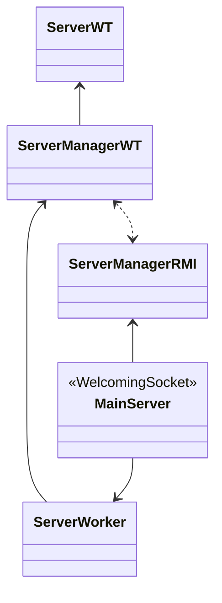

PROGETTO WORTH

Indice

[toc]

# Struttura classi



uso `ConcurrentHashMap` per le registrazioni in quanto tutte le operazioni sono garantite essere *thread-safe*. 
Non vi sono sovrapposizioni fra inserimenti e rimozioni in quanto un utente non può registrarsi ed effettuare il login contemporaneamente, pertanto reputo tale scelta la più efficiente garantendo l'accesso concorrente alla struttura dati. 
Di conseguenza non ho bisogno di gestire la concorrenza server-side riguardo l'RMI.

```sequence
title: COMUNICAZIONE CLIENT-SERVER - RMI
Client->Server: REGISTER(username, password)
Server-->Client: REGISTRATION_OK || USERNAME_ALREADY_PRESENT
```


```sequence
title: COMUNICAZIONE CLIENT-SERVER: Protocollo, operazioni
Client->Server: LOGIN;username;password
Server-->Client: LOGIN_OK \n USERNAME_NOT_PRESENT || PSW_INCORRECT || ALREADY_LOGGED_IN
Client->Server: LOGOUT;username
Server-->Client: LOGOUT_OK || USERNAME_NOT_PRESENT || USER_NOT_ONLINE
Client->Server: CREATE_PROJECT;username;projectName
Server-->Client: CREATE_PROJECT_OK;MulticastIP || PROJECT_ALREADY_PRESENT || \n SERVER_INTERNAL_NETWORK_ERROR
```


# Ipotesi

- un utente può loggarsi su una sola connessione (no login multipli)